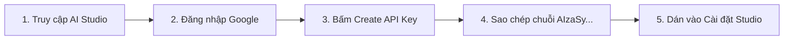
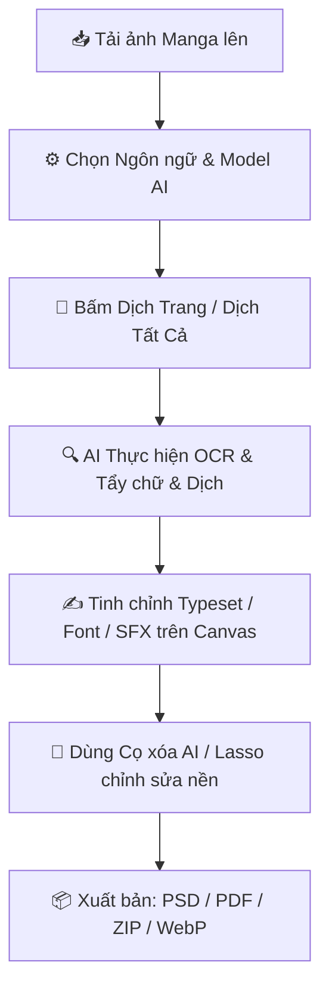

<div align="center">

# 📚 Manga Translator Studio

### **Nền tảng Dịch thuật & Typeset Truyện tranh Tự động bằng AI Đa phương thức**

*Dành cho Scanlation Group, Dịch giả Manga/Manhwa/Manhua, và Độc giả Toàn cầu.*

[](package.json)
[](https://manga-translator-studio.pages.dev/)
[](tsconfig.json)
[](vite.config.ts)
[](package.json)
[](LICENSE)

[](#)
[](README_EN.md)
[](#-hỗ-trợ-đa-nhà-cung-cấp-ai--local-llm)

<br/>

> 🌐 **Trải nghiệm trực tiếp ngay trên trình duyệt (Không cần cài đặt)**:  
> 👉 **[https://manga-translator-studio.pages.dev/](https://manga-translator-studio.pages.dev/)**

<br/>

---

### 📸 Ảnh xem trước kết quả dịch (Demo Preview)


---

</div>

## 📌 Mục lục

- [🌟 Giới thiệu](#-giới-thiệu)
- [✨ Tính năng nổi bật](#-tính-năng-nổi-bật)
  - [🤖 Đa Nhà cung cấp AI & Dịch thuật Đa phương thức](#-đa-nhà-cung-cấp-ai--dịch-thuật-đa-phương-thức)
  - [⛩️ Bộ quy tắc Scanlation Nhật - Việt Chuyên sâu](#️-bộ-quy-tắc-scanlation-nhật---việt-chuyên-sâu)
  - [🎨 Bộ công cụ Tẩy chữ & Redraw Chuẩn Photoshop](#-bộ-công-cụ-tẩy-chữ--redraw-chuẩn-photoshop)
  - [✍️ Canvas Engine & Typesetting Độc quyền](#️-canvas-engine--typesetting-độc-quyền)
  - [🧠 Bộ nhớ Ngữ cảnh Chương & Dossier Lorebook](#-bộ-nhớ-ngữ-cảnh-chương--dossier-lorebook)
  - [📦 Hệ sinh thái Xuất bản Đa định dạng (PSD, PDF, ZIP, Project)](#-hệ-sinh-thái-xuất-bản-đa-định-dạng)
- [🔑 Hướng dẫn lấy Gemini API Key (Miễn Phí)](#-hướng-dẫn-lấy-gemini-api-key-miễn-phí)
- [🚀 Hướng dẫn Cài đặt & Khởi chạy](#-hướng-dẫn-cài-đặt--khởi-chạy)
  - [Cách 1: Sử dụng Trực tuyến (Khuyên dùng)](#cách-1-sử-dụng-trực-tuyến-khuyên-dùng)
  - [Cách 2: Khởi chạy Dev Server (Vite)](#cách-2-khởi-chạy-dev-server-vite)
  - [Cách 3: Chạy 1-Click Script (Windows / macOS / Linux)](#cách-3-chạy-1-click-script-windows--macos--linux)
  - [Cách 4: Chạy qua Node.js hoặc Python CLI](#cách-4-chạy-qua-nodejs-hoặc-python-cli)
- [📖 Hướng dẫn Quy trình Dịch chuẩn (Workflow)](#-hướng-dẫn-quy-trình-dịch-chuẩn-workflow)
- [⌨️ Bảng Phím tắt Nhanh (Shortcuts)](#️-bảng-phím-tắt-nhanh-shortcuts)
- [🛠️ Cấu trúc Mã nguồn (Project Structure)](#️-cấu-trúc-mã-nguồn-project-structure)
- [🧪 Kiểm thử & Đảm bảo Chất lượng](#-kiểm-thử--đảm-bảo-chất-lượng)
- [❓ Câu hỏi thường gặp (FAQ) & Khắc phục sự cố](#-câu-hỏi-thường-gặp-faq--khắc-phục-sự-cố)
- [📄 Giấy phép (License)](#-giấy-phép-license)

---

## 🌟 Giới thiệu

**Manga Translator Studio** là một Studio dịch thuật và dàn trang (Typesetting) truyện tranh thế hệ mới, hoạt động hoàn toàn trên nền tảng Web Client-side. Kết hợp sức mạnh của các mô hình Vision-Language tân tiến nhất (**Google Gemini 3.1 Flash-Lite / 3.5 Flash / Pro**, **Anthropic Claude 3.7**, **OpenAI GPT-4o**, **Local LLM qua Ollama/LM Studio**), ứng dụng giải quyết toàn diện chuỗi quy trình chuyển ngữ truyện tranh:

1. **OCR & Phát hiện bong bóng thoại**: Tự động nhận diện toạ độ khung thoại chuẩn xác, tách cột chữ dọc Nhật Bản, gom nhóm Furigana.
2. **Dịch thuật chuẩn ngữ Scanlation**: Hiểu sâu sắc thái văn phong, xưng hô, kính ngữ, từ tượng thanh (SFX), duy trì tính liên tục của mạch truyện.
3. **Xóa chữ & Khôi phục nét vẽ (Inpainting/Redraw)**: Thuật toán BSS (Best-Shift Patch Synthesis), Cọ xóa AI (Spot Healing), Lasso AI tự động lấp đầy nền không làm mờ hạt screentone.
4. **Typeset tự động & Chỉnh sửa Canvas chuyên nghiệp**: Tự động co giãn cỡ chữ (Auto-fit), ngắt dòng theo hình kim cương (Diamond Wrap), uốn cong theo cung (Arc), xoay SFX 360°, xuất file Photoshop PSD phân lớp.

> [!NOTE]
> **Bảo mật & Quyền riêng tư 100%**: Ứng dụng xử lý dữ liệu hoàn toàn tại trình duyệt của bạn (Client-side). API Key và hình ảnh truyện không bao giờ được lưu trữ trên bất kỳ máy chủ trung gian nào.

---

## ✨ Tính năng nổi bật

### 🤖 Đa Nhà cung cấp AI & Dịch thuật Đa phương thức
- **Google Gemini**: Tối ưu hóa cho `Gemini 3.1 Flash-Lite`, `Gemini 3.5 Flash`, `Gemini 3.1 Pro Preview`.
- **Anthropic Claude**: Tích hợp `Claude 3.7 Sonnet`, `Claude 3.5 Sonnet` với khả năng hành văn mượt mà.
- **OpenAI**: Hỗ trợ `GPT-4o`, `GPT-4o-mini`.
- **Local LLM (Tự host offline)**: Kết nối trực tiếp đến **Ollama** (`http://localhost:11434/v1`) hoặc **LM Studio** (`http://localhost:1234/v1`) để dịch không giới hạn mà không cần internet.
- **Kiến trúc Tự động Thử lại (Smart Retry & Rate Limit)**: Cơ chế exponential backoff thông minh giúp vượt qua giới hạn tần suất (Error 429) của API Key miễn phí một cách mượt mà.

### ⛩️ Bộ quy tắc Scanlation Nhật - Việt Chuyên sâu
- **Ma trận Xưng hô 5 tầng**: Phân loại chuẩn xác đại từ nhân xưng theo vai vế, tính cách và bối cảnh quan hệ (*Watashi, Boku, Ore, Atashi, Oresama, Anata, Omae, Kisama, Kimi*).
- **Xử lý Hậu tố Kính ngữ**: Giữ nguyên hoặc chuyển ngữ linh hoạt các hậu tố scanlation đặc trưng (*-san, -kun, -chan, -sama, -senpai, -sensei, -dono, -tan*).
- **Chuyển đổi Từ đệm & Ngữ khí**: Tinh chỉnh sắc thái câu thoại qua trợ từ ngữ khí (*ne, yo, na, zo, wa, kashira, jan, kke*).
- **Xử lý Từ tượng thanh (SFX) & Aizuchi**: Chuyển ngữ tự nhiên các thán từ và âm thanh hành động comic.

### 🎨 Bộ công cụ Tẩy chữ & Redraw Chuẩn Photoshop
- **Cọ xóa AI (Spot Healing Brush)**: Tô chọn vùng chữ/SFX và nhả chuột để thuật toán tự động tái tạo nền nét vẽ chỉ trong mili-giây.
- **Lasso AI & Content-Aware Fill**: Khoanh vùng tự do, tự động cô lập biên nét chữ (Fuzziness) và lấp đầy nền thông minh.
- **Thuật toán BSS (Best-Shift Patch Synthesis)**: Phân tích cấu trúc hạt screentone xung quanh để ghép mảng nền liền mạch.
- **Bù hạt nhiễu thích ứng (Adaptive Grain Matching)**: Tự động thêm noise mịn tiệp với chất giấy manga cổ điển, ngăn chặn hiện tượng nhòe kỹ thuật số.
- **Con dấu Texture (Clone Stamp Tool)** & **Cọ hút màu (Eyedropper)**: Sao chép hoa văn nền và hút màu chuẩn xác từng pixel.
- **Thay đổi Ảnh nền giữ nguyên Thoại (Quick Image Replacement)**: Kéo thả ảnh mới (sau khi upscale Waifu2x hoặc retouch trong Photoshop) vào Canvas mà **bảo toàn 100% toạ độ ô thoại, bản dịch, font chữ và lorebook**.

### ✍️ Canvas Engine & Typesetting Độc quyền
- **Thuật toán Ngắt dòng Kim cương (Diamond Wrap)**: Tự động xếp dòng chữ nở ở giữa và thon ở hai đầu, ôm khít bong bóng thoại hình oval/tròn chuẩn manga.
- **Hỗ trợ Chữ Dọc & Chữ Ngang (Vertical & Horizontal Text)**: Tự động căn giữa cột và ngắt dòng chữ dọc cho truyện tranh truyền thống Nhật Bản.
- **Auto-fit Font Size**: Tự động tính toán cỡ chữ tối ưu để văn bản lấp đầy khung thoại đẹp mắt mà không tràn viền.
- **Bộ Font chữ Việt hóa Chuyên dụng**: Tuyển tập font truyện tranh đỉnh cao: *Be Vietnam Pro, Bangers, Comic Neue, Caveat, Chakra Petch, Permanent Marker, Bungee, Saira Condensed, Nunito, Inter*.
- **Tùy biến SFX Nâng cao**: Thanh trượt xoay góc (`-180° đến 180°`), uốn cong chữ theo hình vòng cung (`Arc`), viền nét đa tầng (`Stroke`) và đổ bóng (`Drop Shadow`).
- **Nút Định dạng Nhanh 1-Click**: Áp dụng tức thì preset Viền chữ 4px + Nền trong suốt 0% cho thoại chèn đè tranh vẽ phức tạp.

### 🧠 Bộ nhớ Ngữ cảnh Chương & Dossier Lorebook
- **Chapter Story Memory**: Tự động ghi nhớ tóm tắt cốt truyện và xưng hô từ các trang trước, đảm bảo AI dịch đồng nhất từ đầu đến cuối chương.
- **Dossier & Bảng Từ vựng (Glossary)**: Khóa cố định tên nhân vật, địa danh, chiêu thức (ví dụ: *Luffy, Zoro, Bankai, Rasengan*) không bị AI dịch sai nghĩa.
- **Kiểm tra Tính Nhất quán (Consistency Checker)**: Quét toàn bộ chương để phát hiện và cảnh báo các điểm xưng hô lệch pha hoặc vi phạm glossary.

### 📦 Hệ sinh thái Xuất bản Đa định dạng
- **Xuất file PSD phân lớp (Photoshop PSD)**: Giữ nguyên từng layer thoại dạng Text Layer để biên tập viên tinh chỉnh tiếp trên Photoshop.
- **Xuất PDF HD**: Tối ưu chất lượng cao cho máy đọc sách Kindle, iPad và Tablet.
- **Xuất gói ZIP (Tùy chọn dải trang)**: Đóng gói toàn bộ ảnh hoặc xuất theo dải trang tuỳ chọn (Trang A -> Trang B).
- **Sao lưu & Khôi phục Dự án**: Xuất/nhập file `.manga` / `.json` chứa đầy đủ tiến trình làm việc.

---

## 🔑 Hướng dẫn lấy Gemini API Key (Miễn Phí)

Manga Translator Studio hỗ trợ sử dụng **Google Gemini API hoàn toàn miễn phí**:



1. **Truy cập**: **[https://aistudio.google.com/app/apikey](https://aistudio.google.com/app/apikey)**
2. **Đăng nhập**: Sử dụng tài khoản Google (Gmail) cá nhân.
3. **Tạo mã**: Nhấn vào nút **"Create API key"** -> Chọn **"Create API key in new project"**.
4. **Sao chép**: Nhấn nút **Copy** để lưu chuỗi API Key (`AIzaSy...`).
5. **Kích hoạt**: Mở Manga Translator Studio, vào **Cài đặt** (biểu tượng bánh răng), dán Key vào ô **Gemini API Key** và lưu lại.

> [!TIP]
> **Khuyên dùng Model**: Chọn **Gemini 3.1 Flash-Lite** để có tốc độ phản hồi nhanh nhất, chất lượng dịch truyện tự nhiên và hạn mức gọi API miễn phí dồi dào nhất.

---

## 🚀 Hướng dẫn Cài đặt & Khởi chạy

### Cách 1: Sử dụng Trực tuyến (Khuyên dùng)
Không cần cài đặt bất kỳ phần mềm nào:
👉 **Truy cập ngay:** **[https://manga-translator-studio.pages.dev/](https://manga-translator-studio.pages.dev/)**

---

### Cách 2: Khởi chạy Dev Server (Vite)
Dành cho lập trình viên muốn phát triển hoặc tùy biến mã nguồn:

```bash
# 1. Clone repository
git clone https://github.com/linh4264/manga_translator_studio.git
cd manga_translator_studio

# 2. Cài đặt dependencies (yêu cầu Node.js 18+ hoặc Bun)
npm install
# hoặc nếu dùng Bun:
# bun install

# 3. Khởi chạy máy chủ phát triển Vite
npm run dev
# hoặc:
# bun run dev
```
Trình duyệt sẽ tự động mở tại địa chỉ: `http://localhost:5173`.

---

### Cách 3: Chạy 1-Click Script (Windows / macOS / Linux)
- **Trên Windows**: Nhấp đúp chuột vào tệp [server/start.bat](file:///d:/manga/manga_translator_studio/server/start.bat).
- **Trên macOS / Linux**: Cấp quyền và khởi chạy:
  ```bash
  chmod +x server/start.sh
  ./server/start.sh
  ```

---

### Cách 4: Chạy qua Node.js hoặc Python CLI
Khởi chạy máy chủ tĩnh Zero-dependency:

```bash
# Chạy server tích hợp sẵn:
node server/server.js

# Hoặc dùng npx:
npx serve public -l 3000

# Hoặc dùng Python 3:
python -m http.server 3000 --directory public
```
Mở trình duyệt tại: `http://localhost:3000`.

---

## 📖 Hướng dẫn Quy trình Dịch chuẩn (Workflow)



1. **Bước 1: Tải ảnh**: Kéo thả toàn bộ các trang truyện của chương vào khung làm việc bên trái.
2. **Bước 2: Cấu hình**: Chọn ngôn ngữ nguồn (Tiếng Nhật/Hàn/Trung/Anh), ngôn ngữ đích (Tiếng Việt) và chọn Preset thể loại (Shounen, Isekai, Hài hước...).
3. **Bước 3: Dịch tự động**: Bấm **"Dịch trang này"** hoặc **"Dịch tất cả"** (Batch Translation).
4. **Bước 4: Tinh chỉnh & Typeset**:
   - Nhấp vào ô thoại để sửa chữ, đổi font, kéo thanh xoay SFX hoặc uốn cong Arc.
   - Sử dụng **Cọ xóa AI (Spot Healing)** hoặc **Cọ Tẩy (Eraser)** nếu cần xóa chữ nghệ thuật ngoài lề.
5. **Bước 5: Xuất bản**: Chọn **Xuất ZIP**, **Xuất PDF**, hoặc **Xuất PSD** để hoàn tất chương truyện.

---

## ⌨️ Bảng Phím tắt Nhanh (Shortcuts)

| Phím tắt | Chức năng thao tác |
| :--- | :--- |
| `Ctrl + Z` / `Cmd + Z` | **Hoàn tác (Undo)** thao tác vừa thực hiện |
| `Ctrl + Y` / `Cmd + Y` | **Làm lại (Redo)** |
| `Scroll chuột` | Cuộn dọc khung vẽ (Vertical Pan) |
| `Ctrl + Scroll` | Cuộn ngang khung vẽ (Horizontal Pan) |
| `Alt + Scroll` | **Thu phóng (Zoom in / Zoom out)** mượt mà tại tâm chuột |
| `Ctrl + +` / `Ctrl + -` | Phóng to / Thu nhỏ khung vẽ |
| `Ctrl + 0` | Đặt lại tỉ lệ hiển thị chuẩn (Reset Zoom 100%) |
| `Tab` / `Shift + Tab` | Chuyển nhanh đến ô thoại tiếp theo / ô thoại trước đó |
| `Ctrl + D` / `Cmd + D` | Nhân bản (Duplicate) ô thoại đang chọn |
| `Delete` / `Backspace` | Xóa ô thoại đang chọn |
| Phím `[` / `]` | Giảm / Tăng nhanh kích thước phông chữ (Font Size) |
| `N` / `P` | Chuyển sang Trang kế tiếp (Next) / Trang trước (Previous) |
| `Phím mũi tên (↑ ↓ ← →)` | Di chuyển vị trí ô thoại (Giữ `Shift` để di chuyển nhanh 10px) |

---

## 🛠️ Cấu trúc Mã nguồn (Project Structure)

```text
manga_translator_studio/
├── index.html                 # Giao diện chính của ứng dụng
├── vite.config.ts             # Cấu hình Vite & Vitest
├── tsconfig.json              # Cấu hình TypeScript
├── package.json               # Quản lý script & dependencies
├── public/                    # Tài nguyên tĩnh, demo, font chữ, icon
│   └── demo.jpg               # Ảnh demo preview
├── src/                       # Mã nguồn TypeScript mô-đun hóa
│   ├── main.ts                # Điểm khởi động ứng dụng (Entrypoint)
│   ├── config/                # Cấu hình hệ thống, hằng số, danh mục font
│   ├── core/                  # Quản lý State, Event Bus, Bootstrap, i18n
│   ├── types/                 # Định nghĩa TypeScript interfaces & types
│   ├── ui/                    # Quản lý modal, toolbar, thanh trượt, thông báo
│   ├── workers/               # Web Workers xử lý song song
│   └── features/              # Các mô-đun tính năng độc lập
│       ├── ai/                # Client Gemini, Claude, OpenAI, Story Memory
│       ├── canvas/            # Canvas Renderer, Diamond Wrap, Autofit, Arc
│       ├── inpainting/        # PatchMatch, BSS, Spot Healing, Lasso AI
│       ├── ocr/               # OCR Normalizer, Magic Wand, Reading Order
│       ├── io/                # Xuất/Nhập ZIP, PDF, PSD layers, Manga Project
│       ├── fs-access.ts       # File System Access API (Đồng bộ thư mục)
│       └── dossier-lorebook.ts# Bảng thuật ngữ Lorebook & Consistency
├── server/                    # Máy chủ tĩnh Zero-dependency & Script khởi chạy
│   ├── server.js              # Node.js Static Server
│   ├── start.bat              # Script 1-click cho Windows
│   └── start.sh               # Script 1-click cho Linux/macOS
└── tests/                     # Hệ thống kiểm thử tự động Vitest
    ├── setup/                 # Giả lập môi trường Browser & DOM
    ├── unit/                  # Unit tests: core, ai, canvas, ocr, io, inpaint
    └── regression/            # Regression tests chống lỗi hồi quy
```

---

## 🧪 Kiểm thử & Đảm bảo Chất lượng

Dự án duy trì bộ kiểm thử tự động toàn diện với **Vitest**:

```bash
# Chạy toàn bộ test suite
npm run test

# Chạy test kèm chế độ theo dõi (Watch mode)
npm run test:watch

# Chạy kiểm tra kiểu tĩnh TypeScript
npm run typecheck

# Chạy riêng từng module test
npm run test:canvas      # Kiểm tra thuật toán wrap chữ & canvas
npm run test:ai          # Kiểm tra kết nối AI & retry logic
npm run test:ocr         # Kiểm tra chuẩn hóa toạ độ OCR
npm run test:inpainting  # Kiểm tra thuật toán xóa chữ BSS & inpaint
npm run test:io          # Kiểm tra đóng gói ZIP, PDF, PSD
```

---

## ❓ Câu hỏi thường gặp (FAQ) & Khắc phục sự cố

<details>
<summary><b>1. Dùng Gemini API Key có bị tính phí không?</b></summary>
<br/>
<b>Không!</b> Google cung cấp gói <b>Free Tier</b> rất rộng rãi cho người dùng cá nhân (lên tới 15 RPM tùy model). Bạn có thể thoải mái dịch hàng trăm trang truyện tranh mỗi ngày mà hoàn toàn không mất bất kỳ chi phí nào.
</details>

<details>
<summary><b>2. Tại sao tôi gặp lỗi "429 Too Many Requests"?</b></summary>
<br/>
Lỗi 429 xuất hiện khi các yêu cầu dịch gửi đi quá nhanh vượt quá giới hạn hạn mức Free Tier của Google.  
<b>Cách khắc phục:</b> Mở bảng <b>Cài đặt</b> -> Tại mục <b>Giới hạn tần suất API</b>:  
- Đặt <b>Giãn cách gửi (API Delay)</b>: từ 8 đến 12 giây.  
- Đặt <b>Số lần thử lại (Max Retries)</b>: 5 lần.  
Hệ thống sẽ tự động điều phối hàng đợi và thử lại khi hết thời gian nghẽn.
</details>

<details>
<summary><b>3. Tại sao chữ tiếng Nhật dọc bị ngắt dòng sai?</b></summary>
<br/>
Ứng dụng có sẵn tùy chọn <b>Chữ Dọc (Vertical Text)</b>. Bạn chỉ cần chọn khung thoại, bật nút <b>Chữ Dọc</b> trên thanh công cụ Typeset, hệ thống sẽ tự động căn giữa các cột dọc và xếp từ trên xuống dưới theo đúng quy chuẩn đọc manga.
</details>

<details>
<summary><b>4. Dữ liệu của tôi có được bảo mật không?</b></summary>
<br/>
<b>Tuyệt đối an toàn.</b> Ứng dụng hoạt động 100% Client-side trong trình duyệt. Không có cơ sở dữ liệu bên ngoài nào thu thập ảnh hay API key của bạn. Dữ liệu chỉ được gửi trực tiếp từ máy của bạn đến endpoint chính thức của AI Provider.
</details>

---

## 📄 Giấy phép (License)

Dự án được phân phối dưới giấy phép mã nguồn mở [MIT License](LICENSE). Mọi người đều có quyền tự do sử dụng, chỉnh sửa và phân phối cho mục đích cá nhân hoặc phi thương mại.

<div align="center">

**Manga Translator Studio** — *Được phát triển với niềm đam mê dành cho cộng đồng Manga & Scanlation.*

[](https://github.com/linh4264/manga_translator_studio)
[](https://github.com/linh4264/manga_translator_studio/fork)

</div>
