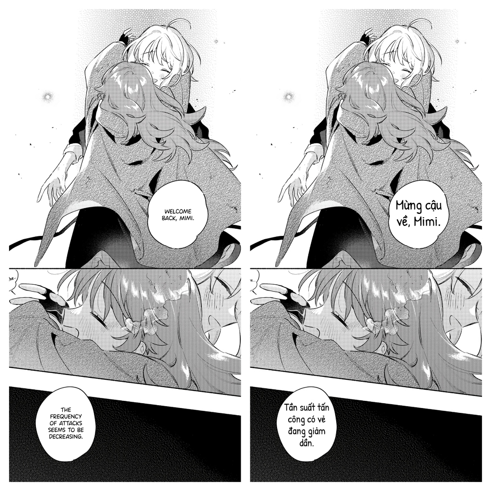

# 📚 Manga Translator Studio - AI Translation & Typesetting Tool

[](#)
[](README_EN.md)


> [!NOTE]
> **English Version**: [README_EN.md](README_EN.md) is available for English-speaking users.

### 📸 Kết quả dịch mẫu (Translation Preview)



**Manga Translator Studio** là ứng dụng web chuyên nghiệp hỗ trợ dịch thuật tự động và typeset (trình bày chữ) cho truyện tranh (*Manga, Manhua, Manhwa, Comic, Scanlation*). Tích hợp công nghệ AI đa phương thức hàng đầu của **Google Gemini** (Gemini 3.1 Flash-Lite, Gemini 3.5 Flash, Gemini Pro...), ứng dụng giúp tự động nhận diện bong bóng thoại (OCR), dịch sang tiếng Việt (hoặc các ngôn ngữ khác) tự nhiên chuẩn văn phong comic, và tự động điền chữ (Typeset) vừa vặn vào khung thoại.

---

## ✨ Tính năng nổi bật

- 🌐 **Hỗ trợ Giao diện Đa Ngôn ngữ (Simple UI i18n)**:
  - Tích hợp cơ chế dịch thuật giao diện tĩnh giúp chuyển đổi ngôn ngữ hiển thị của Studio giữa **Tiếng Việt** và **Tiếng Anh** chỉ với 1 cú click trong Cài đặt.
- 🤖 **Hỗ trợ Đa Nhà Cung Cấp AI & Local LLM**:
  - Tích hợp **Google Gemini**, **Anthropic Claude** (Claude 3.7/3.5 Sonnet), **OpenAI** (GPT-4o), và **Custom Local LLM** (Ollama: `http://localhost:11434/v1`, LM Studio: `http://localhost:1234/v1`).
- ⛩️ **Hệ thống Prompt Chuyên sâu Nhật-Việt (Japanese-to-Vietnamese Scanlation Master Spec)**:
  - Quy tắc dịch thuật 5 tầng chuyên sâu: Phân tích sắc thái xưng hô (*Watashi, Boku, Ore, Atashi, Oresama, Anata, Omae, Kisama, Kimi*), chuyển đổi từ đệm ngữ điệu (*ne, yo, na, zo, wa, kashira, jan, kke*), xử lý từ lóng/Aizuchi, giữ nguyên hậu tố xưng hô Scanlation (*-san, -kun, -chan, -sama, -senpai, -sensei, -dono, -tan*), và chuyển ngữ từ tượng thanh (SFX).
- 🧠 **Bộ nhớ ngữ cảnh chương (Chapter Story Memory)**:
  - Tự động nối kết quả xưng hô & tóm tắt diễn biến giữa các trang liền kề giúp AI dịch nhất quán giọng văn từ trang 1 đến hết chương.
- 🖼️ **Đổi ảnh gốc giữ nguyên ô thoại (Quick Background Image Replacement)**:
  - Thay đổi ảnh nền manga (sau khi upscale qua Waifu2x hoặc retouch trong Photoshop) mà **bảo toàn 100% danh sách ô thoại, vị trí, bản dịch và phông chữ**. Hỗ trợ kéo thả trực tiếp file ảnh mới vào khung màn hình làm việc!
- 🎨 **Bộ công cụ Tẩy chữ & Redraw Chuyên nghiệp (Photoshop-Grade Redrawing Tools)**:
  - **Cọ xóa AI (Spot Healing Brush)**: Tô mảng màu tím lên chữ/SFX và nhả chuột để ứng dụng tự động khôi phục nét vẽ nền client-side siêu tốc.
  - **Lasso AI & Content-Aware Fill**: Khoanh vùng chọn tự do, tự động cô lập viền nét chữ (Fuzziness) và lấp đầy nền bằng thuật toán Offline BSS hoặc Online Gemini AI (có tự động chuyển dự phòng khi hết quota API).
  - **Thuật toán BSS (Best-Shift Patch Synthesis) & Bù hạt nhiễu thích ứng (Adaptive Grain Matching)**: Tự động phân tích cấu trúc hạt screentone và bù hạt nhiễu mịn giúp mảng xóa không bị nhòe kỹ thuật số.
  - **Đóng dấu Texture (Clone Stamp Tool)**: Quét sao chép vùng screentone hạt và dán đè hình tròn làm mịn viền.
  - **Cọ hút màu (Eyedropper)**: Chấm hút trực tiếp màu nền trên trang truyện.
- 💥 **Bộ công cụ SFX chuyên sâu (Sound Effects & Rotated Text)**:
  - Phân loại khung thoại (`Lời thoại` / `💥 SFX Hiệu ứng`), chỉnh góc xoay (`Rotation Slider: -180° đến 180°`), góc uốn cong (`Arc Slider`) và hiệu ứng viền/bóng chữ.
- 📐 **Điều khiển Thu phóng Độc lập (Interactive Zoom Controls)**:
  - Thanh công cụ thu phóng góc dưới màn hình, cuộn chuột tương tác (`Ctrl + Scroll`), phím tắt (`Ctrl + +`, `Ctrl + -`, `Ctrl + 0`). Mọi thao tác zoom độc lập hoàn toàn với ảnh xuất PNG/ZIP/PDF.
- ⚡ **Nút Định dạng Nhanh Nền 0% + Viền 4px**:
  - Nút áp dụng 1-click định dạng viền nét chữ 4px kèm nền trong suốt Opacity 0% chuyên dụng cho ô thoại chèn đè tranh vẽ.
- 🎨 **Bộ công cụ Typeset & Canvas chuyên sâu**:
  - Tự động canh chỉnh kích thước phông chữ (Auto-fit font size) vừa khít khung thoại.
  - Hỗ trợ viết chữ ngang và chữ dọc (Vertical Text) cho manga truyền thống: tự động căn giữa ngang và ngắt cột dọc thông minh chuẩn manga chuyên nghiệp.
  - Đầy đủ font chữ truyện tranh độc quyền: *Be Vietnam Pro, Bangers, Comic Neue, Caveat, Chakra Petch, Permanent Marker, Bungee, Saira Condensed, Nunito, Inter*.
  - Tùy chỉnh màu chữ, màu viền (Stroke), màu nền (Background opacity), căn lề, khoảng cách dòng/chữ.
- 🧹 **Cọ tẩy chữ mạnh mẽ (Eraser Tool)**:
  - Tẩy sạch chữ gốc trong bong bóng thoại bằng màu tự chọn (Trắng/Đen/Màu tự do qua Cọ hút màu).
- 🧠 **Cấu hình dịch thuật nâng cao (Advanced Translation Controls)**:
  - **Glossary & Giữ tên nhân vật**: Không dịch tên riêng hoặc danh từ đặc biệt (vd: *Luffy, Zoro, Nami, Sakura*).
  - **Mẫu Prompt theo thể loại (Genre Presets)**: Hài hước, Học đường, Shounen, Fantasy/Isekai, Horror, Drama, Romance...
  - **Tăng cường tương phản OCR**: Tiền xử lý ảnh giúp AI nhận diện chuẩn chữ mờ, SFX nhạt.
- 📦 **Quản lý danh sách & Xuất file đa dạng**:
  - Dịch hàng loạt (Batch Translation) cả chương truyện chỉ với 1 cú click.
  - Chế độ xem trước (Preview Mode) cho phép đọc duyệt toàn bộ chương truyện.
  - Chọn phạm vi trang xuất (Export Range Selection: Từ trang A đến trang B) khi đóng gói file ZIP hoặc ghép file PDF.
  - Xuất ảnh lẻ (PNG/JPG/WebP), gói bộ ảnh **ZIP**, hoặc xuất file **PDF HD** đọc trên Tablet/Kindle.
  - **Sao lưu & Khôi phục (Backup & Restore)**: Lưu lại dự án dưới dạng file `.manga` / `.json` để tiếp tục làm sau.
  - Kiểm tra nhất quán (Consistency Check) quét từ lặp và xưng hô trên toàn bộ các trang.

---

## 🔑 Hướng dẫn lấy Gemini API Key (Miễn Phí)

Manga Translator Studio sử dụng **Google Gemini API** để nhận diện ảnh và dịch thuật. Bạn có thể dễ dàng lấy một API Key **hoàn toàn miễn phí** từ Google theo các bước sau:

### Bước 1: Truy cập Google AI Studio
Bấm vào đường dẫn: **[https://aistudio.google.com/app/apikey](https://aistudio.google.com/app/apikey)** (hoặc [aistudio.google.com](https://aistudio.google.com/)).

### Bước 2: Đăng nhập tài khoản Google
Sử dụng tài khoản Google (Gmail) cá nhân của bạn để đăng nhập.

### Bước 3: Tạo API Key
1. Tại giao diện Google AI Studio, nhấn vào nút **"Create API key"** (Tạo API key mới) hoặc **"Get API key"**.
2. Chọn **"Create API key in new project"** (Tạo API key trong dự án mới) hoặc chọn một dự án Google Cloud có sẵn.
3. Đợi vài giây để Google khởi tạo key.

### Bước 4: Sao chép API Key
Nhấn nút **"Copy"** để sao chép chuỗi mã API Key (có dạng bắt đầu bằng `AIzaSy...`).

> [!TIP]
> **Lưu ý bảo mật**: Không chia sẻ API Key này cho người khác. Key được lưu an toàn trực tiếp trên trình duyệt của bạn (LocalStorage) và không gửi đi bất kỳ máy chủ trung gian nào.

---

## 🚀 Hướng dẫn chạy ứng dụng

> [!IMPORTANT]
> **Lưu ý về ES Modules**: Vì ứng dụng sử dụng cấu trúc mã nguồn dạng mô-đun hiện đại (ES Modules `import`/`export`), trình duyệt sẽ chặn tải file nếu mở trực tiếp bằng giao thức `file://` (Double-click vào `index.html` sẽ gặp lỗi CORS). **Bạn bắt buộc phải chạy ứng dụng thông qua một máy chủ Web cục bộ (Local Web Server).**

Dưới đây là các cách cực kỳ đơn giản để khởi chạy:

### Cách 1: Khởi chạy nhanh một-click (Khuyên dùng)
*   **Trên Windows:** Nhấp đúp chuột vào tệp [start.bat](/manga-translator-studio/server/start.bat). Hệ thống sẽ tự động khởi chạy máy chủ web Node.js thuần (hoặc Python) và mở trình duyệt tại địa chỉ `http://localhost:3000`.
*   **Trên macOS/Linux:** Mở Terminal tại thư mục dự án, chạy lệnh cấp quyền `chmod +x start.sh` (chỉ cần chạy một lần duy nhất), sau đó nhấp đúp hoặc chạy `./start.sh` để mở máy chủ.

### Cách 2: Chạy trực tiếp qua Node.js (server.js có sẵn)
Mở cửa sổ Command Prompt / Terminal tại thư mục dự án và chạy:
```bash
node server.js
```
Máy chủ tĩnh zero-dependency sẽ khởi chạy và tự động mở trình duyệt web.

### Cách 3: Sử dụng VS Code Live Server (Cho lập trình viên)
1. Mở thư mục dự án trong phần mềm **VS Code**.
2. Cài đặt extension **Live Server** (của nhà phát triển *Ritwick Dey*).
3. Nhấp chuột phải vào file [index.html](/manga-translator-studio/public/index.html) -> chọn **"Open with Live Server"** (hoặc bấm nút **"Go Live"** ở góc dưới cùng bên phải VS Code).

### Cách 4: Sử dụng CLI npx serve hoặc Python
*   **Dùng Node npx:** Chạy lệnh `npx serve public` và truy cập `http://localhost:3000`.
*   **Dùng Python:** Chạy lệnh `python -m http.server 3000 --directory public` và truy cập `http://localhost:3000`.

---

## 📖 Hướng dẫn sử dụng chi tiết

### 1. Cấu hình API Key & Mô hình AI
1. Mở ô **Cài đặt** hoặc bảng điều khiển ở cột bên trái.
2. Dán **Gemini API Key** vừa lấy được vào ô **Gemini API Key**.
3. Chọn **Mô hình AI (Model)**:
   - `Gemini 3.1 Flash-Lite` *(Khuyên dùng)*: Nhanh, tiết kiệm API quota, chất lượng dịch truyện tự nhiên.
   - `Gemini 3.5 Flash` / `Gemini 3 Flash Preview`: Tốc độ cao, khả năng OCR ấn tượng.
   - `Gemini 3.1 Pro Preview` / `Gemini 2.5 Pro`: Phù hợp cho các bộ truyện phức tạp, đòi hỏi dịch văn phong sâu sắc.
4. Chọn **Ngôn ngữ nguồn** (`Tiếng Nhật`, `Tiếng Trung`, `Tiếng Hàn`, `Tiếng Anh` hoặc `Tự động nhận diện`).

### 2. Tải ảnh & Dịch tự động
1. Kéo thả hoặc bấm vào ô **Tải ảnh Manga lên** để chọn các trang truyện.
2. Bấm nút **"Dịch tất cả"** (Batch Translate) để AI tự động xử lý toàn bộ các trang, hoặc chọn từng trang và bấm **"Dịch trang này"**.
3. Hệ thống sẽ tự động quét bong bóng thoại, tẩy chữ gốc và đè chữ tiếng Việt đã dịch lên ảnh.

### 3. Tinh chỉnh & Typeset trên Canvas
- **Chỉnh sửa văn bản**: Click vào khung thoại trên ảnh để chỉnh sửa nội dung dịch, đổi phông chữ, cỡ chữ, màu sắc, viền chữ...
- **Thêm khung thoại mới**: Bấm **"Thêm khung thoại"** nếu AI bỏ sót văn bản.
- **Dùng Cọ tẩy chữ (Eraser)** & **Spot Healing Brush (Cọ xóa AI)**: Tô đè xóa các chữ thừa ngoài lề hoặc chữ hiệu ứng (SFX) bằng cọ xóa thông minh.
- **Đổi ảnh gốc nhanh**: Bấm nút **Đổi ảnh gốc** hoặc kéo thả file ảnh nền mới vào màn hình làm việc để cập nhật bản vẽ đã upscale/retouch mà không mất dữ liệu thoại.

### 4. Thiết lập từ vựng & Giữ nguyên tên
- **Danh sách giữ tên**: Nhập các tên riêng cần giữ nguyên như `Luffy, Zoro, Nami, Konoha`.
- **Giới hạn tần suất (Rate Limiting)**: Nếu dùng API Key miễn phí, hãy để **Giãn cách gửi: 8-12 giây** và **Số lần thử lại: 5** để tránh bị lỗi 429 (Too Many Requests).

### 5. Xuất bản phẩm
- Bấm **"Xem trước"** để đọc thử toàn bộ chương truyện.
- Bấm **"Xuất ZIP"** (hỗ trợ tùy chọn chọn phạm vi trang từ A đến B) để tải về bộ ảnh đã dịch & typeset hoàn chỉnh.
- Bấm **"Xuất PDF"** để tạo file PDF đọc trên thiết bị di động / máy đọc sách.
- Bấm **"Sao lưu"** để lưu file `.manga` lưu trữ tiến trình công việc.

---

## ⌨️ Bảng phím tắt (Keyboard Shortcuts)

| Phím tắt | Thao tác |
| :--- | :--- |
| `Ctrl + Z` / `Cmd + Z` | Hoàn tác (Undo) thao tác vừa thực hiện |
| `Ctrl + Y` / `Cmd + Y` | Làm lại (Redo) |
| `Ctrl + Scroll` | Thu phóng (Zoom in / Zoom out) màn hình làm việc |
| `Ctrl + +` / `Ctrl + =` | Phóng to màn hình làm việc (Zoom In) |
| `Ctrl + -` | Thu nhỏ màn hình làm việc (Zoom Out) |
| `Ctrl + 0` | Đặt lại tỷ lệ thu phóng gốc (Reset Zoom 100%) |
| `Tab` / `Shift + Tab` | Chuyển đến khung thoại tiếp theo / trước đó |
| `Ctrl + D` / `Cmd + D` | Nhân bản (Duplicate) khung thoại đang chọn |
| `Delete` / `Backspace` | Xóa khung thoại đang chọn |
| Phím `[` / `]` | Giảm / Tăng kích thước phông chữ (Font size) |
| `N` / `P` | Chuyển sang Trang kế tiếp (Next) / Trang trước (Previous) |
| `Phím mũi tên (↑ ↓ ← →)` | Di chuyển vị trí khung thoại đang chọn (Giữ `Shift` để di chuyển nhanh) |

---

## ❓ Câu hỏi thường gặp (FAQ) & Sửa lỗi

<details>
<summary><b>1. Dùng Gemini API Key có mất phí không?</b></summary>
Không! Google cung cấp hạn mức <b>Free Tier</b> rất rộng rãi cho cá nhân (hàng chục yêu cầu mỗi phút tùy model). Bạn hoàn toàn có thể dịch hàng trăm trang truyện mỗi ngày mà không tốn chi phí.
</details>

<details>
<summary><b>2. Tại sao bị lỗi "429 Too Many Requests" hoặc "503 Service Unavailable"?</b></summary>
Do bạn đang dùng API Key miễn phí và gửi yêu cầu quá nhanh liên tục. 
<b>Cách khắc phục:</b> Vào mục Cài đặt -> Cấu hình <i>Giới hạn tần suất API</i>: tăng <b>Giãn cách gửi</b> lên 8-12 giây và cài <b>Số lần thử lại</b> là 5.
</details>

<details>
<summary><b>3. Dữ liệu và hình ảnh của tôi có bị tải lên máy chủ nào không?</b></summary>
Không. Toàn bộ quá trình xử lý ảnh, chỉnh sửa canvas và lưu trữ đều diễn ra <b>trực tiếp tại trình duyệt (Local Client-Side)</b> của bạn. Chỉ có hình ảnh bong bóng thoại được gửi trực tiếp từ trình duyệt của bạn đến Google Gemini API chính thức.
</details>

---

## 📄 Giấy phép (License)

Dự án được phân phối dưới giấy phép [MIT License](LICENSE).

