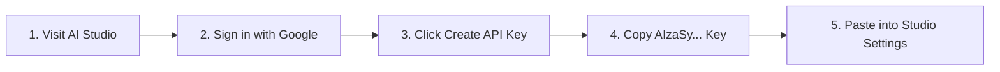
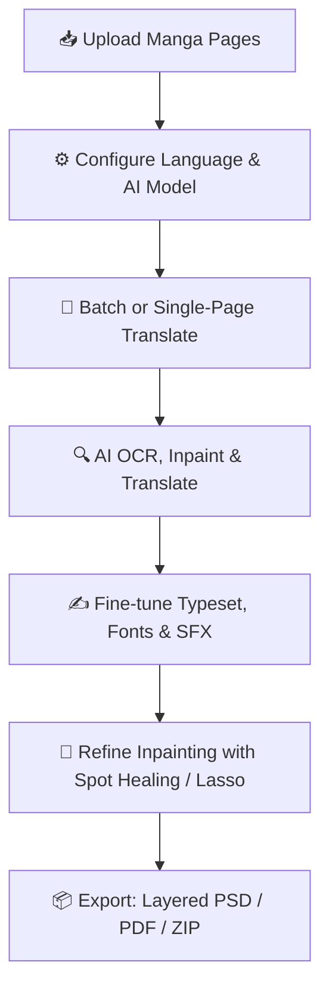

<div align="center">

# 📚 Manga Translator Studio

### **Next-Gen Multimodal AI Manga Translation & Professional Typesetting Studio**

*Engineered for Scanlation Groups, Comic Translators, and Readers Worldwide.*

[](package.json)
[](https://manga-translator-studio.pages.dev/)
[](tsconfig.json)
[](vite.config.ts)
[](package.json)
[](LICENSE)

[](README.md)
[](#)
[](#-multi-provider-ai--local-llms)

<br/>

> 🌐 **Try it directly in your browser (No installation required)**:  
> 👉 **[https://manga-translator-studio.pages.dev/](https://manga-translator-studio.pages.dev/)**

<br/>

---

### 📸 Translation Demo Preview


---

</div>

## 📌 Table of Contents

- [🌟 Overview](#-overview)
- [✨ Key Features](#-key-features)
  - [🤖 Multi-Provider AI & Multimodal Translation](#-multi-provider-ai--multimodal-translation)
  - [⛩️ Japanese Localization & Scanlation Master Spec](#️-japanese-localization--scanlation-master-spec)
  - [🎨 Photoshop-Grade Redrawing & Inpainting Suite](#-photoshop-grade-redrawing--inpainting-suite)
  - [✍️ Advanced Typesetting & Canvas Layout Engine](#️-advanced-typesetting--canvas-layout-engine)
  - [🧠 Chapter Story Memory & Dossier Lorebook](#-chapter-story-memory--dossier-lorebook)
  - [📦 Multi-Format Publishing Ecosystem (PSD, PDF, ZIP, Project)](#-multi-format-publishing-ecosystem)
- [🔑 How to Get a Free Gemini API Key](#-how-to-get-a-free-gemini-api-key)
- [🚀 Quick Start & Installation](#-quick-start--installation)
  - [Option 1: Use Live Online App (Recommended)](#option-1-use-live-online-app-recommended)
  - [Option 2: Run Local Dev Server (Vite)](#option-2-run-local-dev-server-vite)
  - [Option 3: 1-Click Launch Scripts (Windows / macOS / Linux)](#option-3-1-click-launch-scripts-windows--macos--linux)
  - [Option 4: Standalone Node.js or Python CLI](#option-4-standalone-nodejs-or-python-cli)
- [📖 Professional Translation Workflow](#-professional-translation-workflow)
- [⌨️ Keyboard Shortcuts Reference](#️-keyboard-shortcuts-reference)
- [🛠️ Project Architecture & Structure](#️-project-architecture--structure)
- [🧪 Testing & Quality Assurance](#-testing--quality-assurance)
- [❓ FAQ & Troubleshooting](#-faq--troubleshooting)
- [📄 License](#-license)

---

## 🌟 Overview

**Manga Translator Studio** is an all-in-one, client-side web application crafted for professional comic translation, intelligent inpainting, and precise typesetting (*Manga, Manhua, Manhwa, Comic, Webtoon*). Powered by leading vision-language AI models (**Google Gemini 3.1 Flash-Lite / 3.5 Flash / Pro**, **Anthropic Claude 3.7**, **OpenAI GPT-4o**, and **Local LLMs via Ollama/LM Studio**), it streamlines the entire scanlation pipeline:

1. **OCR & Bubble Detection**: Accurately detects dialogue bubble boundaries, vertical Japanese text columns, and furigana groupings.
2. **Scanlation-Grade AI Translation**: Analyzes context, pronoun dynamics, honorifics, sentence particles, and sound effects (SFX) with story continuity.
3. **Smart Inpainting & Redrawing**: Cleanly erases original text and reconstructs background textures using Best-Shift Patch Synthesis (BSS) without blurring halftone screentones.
4. **Automated Typesetting & Canvas Tools**: Dynamic font auto-fitting, smart bubble text wrapping, arc text curvature, SFX 360° rotation, and multi-layered PSD export.

> [!NOTE]
> **100% Client-Side Privacy**: All image editing, inpainting, and project storage happen locally within your browser. API keys and manga images are never transferred to any intermediary servers.

---

## ✨ Key Features

### 🤖 Multi-Provider AI & Multimodal Translation
- **Google Gemini**: Optimized for `Gemini 3.1 Flash-Lite`, `Gemini 3.5 Flash`, and `Gemini 3.1 Pro Preview`.
- **Anthropic Claude**: Full support for `Claude 3.7 Sonnet` and `Claude 3.5 Sonnet` for natural, literary translations.
- **OpenAI**: Integrated with `GPT-4o` and `GPT-4o-mini`.
- **Local Offline LLMs**: Direct connection to **Ollama** (`http://localhost:11434/v1`) or **LM Studio** (`http://localhost:1234/v1`) for private, offline translation.
- **Smart Exponential Backoff & Retry**: Robust rate-limit mitigation that prevents `429 Too Many Requests` halts during batch translations.

### ⛩️ Japanese Localization & Scanlation Master Spec
- **5-Layer Pronoun Hierarchy**: Nuanced contextual mapping for first/second/third-person pronouns (*Watashi, Boku, Ore, Atashi, Oresama, Anata, Omae, Kisama, Kimi*).
- **Honorific Suffix Preservation**: Flexible handling of scanlation conventions (*-san, -kun, -chan, -sama, -senpai, -sensei, -dono, -tan*).
- **Sentence-Ending Particles & Tone**: Accurate tone adjustment via modal particles (*ne, yo, na, zo, wa, kashira, jan, kke*).
- **Comic Onomatopoeia (SFX) & Slang**: Specialized translation presets for sound effects and conversational Japanese.

### 🎨 Photoshop-Grade Redrawing & Inpainting Suite
- **Spot Healing Brush (Cọ xóa AI)**: Highlight text or SFX and release to reconstruct clean background art client-side in milliseconds.
- **Lasso AI & Content-Aware Fill**: Freeform selection tool with automatic edge isolation (Fuzziness threshold) and background reconstruction.
- **Best-Shift Patch Synthesis (BSS)**: Analyzes neighboring halftone screentones to stitch continuous texture patches.
- **Adaptive Grain Matching**: Generates authentic fine sand grain noise to blend seamlessly into vintage paper textures.
- **Clone Stamp Tool** & **Eyedropper**: Sample clean textures and pick exact pixel colors across the canvas.
- **Background Replacement with Dialogue Preservation**: Swap underlying raw art (e.g., after Waifu2x upscaling or manual Photoshop retouching) with **100% retention of text coordinates, styles, and translations**.

### ✍️ Advanced Typesetting & Canvas Layout Engine
- **Smart Line Wrap Algorithm**: Automatically wraps text lines with balanced spacing to hug comic dialogue bubbles naturally.
- **Vertical & Horizontal Text Support**: True vertical typesetting with auto-centered columns and top-to-bottom reading order for traditional manga.
- **Dynamic Auto-Fit Font Size**: Automatically calculates optimal font sizes to fill bubbles cleanly without boundary overflow.
- **Curated Comic Font Catalog**: Preloaded with high-grade manga typography: *Be Vietnam Pro, Bangers, Comic Neue, Caveat, Chakra Petch, Permanent Marker, Bungee, Saira Condensed, Nunito, Inter*.
- **Advanced SFX Controls**: Freely rotate text (`-180° to 180°`), apply curved circular paths (`Arc Slider`), multi-colored outlines (`Stroke`), and drop shadows.
- **1-Click Quick Preset**: Instantly apply 4px outline stroke + 0% background opacity for overlay dialogue over artwork.

### 🧠 Chapter Story Memory & Dossier Lorebook
- **Chapter Story Memory**: Automatically chains scene context and character dynamics between pages to guarantee tone consistency across the entire chapter.
- **Dossier & Glossary System**: Lock character names, locations, and special moves (e.g., *Luffy, Zoro, Bankai, Rasengan*) from mistranslation.
- **Consistency Checker**: Scans all pages in the project to detect pronoun shifts or terminology discrepancies.

### 📦 Multi-Format Publishing Ecosystem
- **Layered Photoshop Export (PSD)**: Generates PSD files with separate editable text layers for downstream post-processing.
- **HD PDF Packaging**: Produces crisp, tablet-ready PDF documents formatted for Kindle, iPad, and e-readers.
- **Custom Page Range ZIP Export**: Download full chapters or extract specific ranges (Page A to Page B).
- **Project Backup & Restore**: Export and import complete workspace sessions using `.manga` or `.json` formats.

---

## 🔑 How to Get a Free Gemini API Key

Manga Translator Studio is compatible with **Google Gemini's generous Free Tier**:



1. **Visit**: **[https://aistudio.google.com/app/apikey](https://aistudio.google.com/app/apikey)**
2. **Sign In**: Log in using your Google (Gmail) account.
3. **Generate Key**: Click **"Create API key"** -> Select **"Create API key in new project"**.
4. **Copy**: Click **Copy** to save your new key (`AIzaSy...`).
5. **Activate**: In Manga Translator Studio, open **Settings** (gear icon), paste the key into **Gemini API Key**, and save.

> [!TIP]
> **Recommended Model**: Select **Gemini 3.1 Flash-Lite** for lightning-fast latency, natural dialogue translation, and generous free quota allowances.

---

## 🚀 Quick Start & Installation

### Option 1: Use Live Online App (Recommended)
No installation or environment setup required:
👉 **Launch Now:** **[https://manga-translator-studio.pages.dev/](https://manga-translator-studio.pages.dev/)**

---

### Option 2: Run Local Dev Server (Vite)
For developers looking to contribute, modify, or extend the source code:

```bash
# 1. Clone the repository
git clone https://github.com/linh4264/manga_translator_studio.git
cd manga_translator_studio

# 2. Install dependencies (Node.js 18+ or Bun required)
npm install
# or with Bun:
# bun install

# 3. Start the Vite development server
npm run dev
# or:
# bun run dev
```
Open your browser at: `http://localhost:5173`.

---

### Option 3: 1-Click Launch Scripts (Windows / macOS / Linux)
- **On Windows**: Double-click [server/start.bat](file:///d:/manga/manga_translator_studio/server/start.bat).
- **On macOS / Linux**: Grant executable permission and run:
  ```bash
  chmod +x server/start.sh
  ./server/start.sh
  ```

---

### Option 4: Standalone Node.js or Python CLI
Run the zero-dependency static file server:

```bash
# Run the built-in server:
node server/server.js

# Or using npx serve:
npx serve public -l 3000

# Or using Python 3:
python -m http.server 3000 --directory public
```
Access the application at: `http://localhost:3000`.

---

## 📖 Professional Translation Workflow



1. **Step 1: Upload Pages**: Drag and drop all chapter images into the left sidebar.
2. **Step 2: Settings & Prompts**: Select source language (Japanese/Korean/Chinese/English), target language, and genre preset.
3. **Step 3: Auto Translation**: Click **"Translate this page"** or **"Translate All"** to trigger batch processing.
4. **Step 4: Typeset & Polish**:
   - Click any bubble to customize text, change font, adjust arc curvature, or rotate SFX.
   - Use the **Spot Healing Brush** or **Eraser** to clean residual background noise.
5. **Step 5: Export**: Choose **Export ZIP**, **Export PDF**, or **Export PSD** to deliver the finished scanlation.

---

## ⌨️ Keyboard Shortcuts Reference

| Shortcut | Description |
| :--- | :--- |
| `Ctrl + Z` / `Cmd + Z` | **Undo** last canvas operation |
| `Ctrl + Y` / `Cmd + Y` | **Redo** last undone operation |
| `Mouse Scroll` | Vertical canvas pan |
| `Ctrl + Scroll` | Horizontal canvas pan |
| `Alt + Scroll` | **Smooth Zoom** centered at mouse cursor |
| `Ctrl + +` / `Ctrl + -` | Zoom in / Zoom out canvas |
| `Ctrl + 0` | Reset canvas zoom to 100% |
| `Tab` / `Shift + Tab` | Navigate to next / previous dialogue bubble |
| `Ctrl + D` / `Cmd + D` | Duplicate currently selected bubble |
| `Delete` / `Backspace` | Delete currently selected bubble |
| Keys `[` / `]` | Decrease / Increase font size of active text box |
| `N` / `P` | Navigate to Next / Previous page |
| `Arrow Keys (↑ ↓ ← →)` | Nudge bubble position (Hold `Shift` to move 10px) |

---

## 🛠️ Project Architecture & Structure

```text
manga_translator_studio/
├── index.html                 # Main Studio interface entry
├── vite.config.ts             # Vite bundler & Vitest configuration
├── tsconfig.json              # TypeScript compilation rules
├── package.json               # Package scripts & dependencies
├── public/                    # Static assets, fonts, demo files
│   └── demo.jpg               # Demo preview screenshot
├── src/                       # Modular TypeScript codebase
│   ├── main.ts                # Application initialization entry
│   ├── config/                # System constants, font catalogues, defaults
│   ├── core/                  # State management, Event Bus, i18n, bootstrap
│   ├── types/                 # TypeScript interfaces & types
│   ├── ui/                    # Modals, toolbars, notifications, sliders
│   ├── workers/               # Web Workers for multi-threaded processing
│   └── features/              # Modular feature domains
│       ├── ai/                # Gemini, Claude, OpenAI clients & Story Memory
│       ├── canvas/            # Canvas Renderer, Smart Wrap, Autofit, Arc
│       ├── inpainting/        # PatchMatch, BSS, Spot Healing, Lasso AI
│       ├── ocr/               # OCR Normalizer, Magic Wand, Reading Order
│       ├── io/                # ZIP, PDF, PSD layers, Manga project export
│       ├── fs-access.ts       # File System Access API (Local sync)
│       └── dossier-lorebook.ts# Character Dossier & Glossary management
├── server/                    # Standalone Zero-dependency server & scripts
│   ├── server.js              # Node.js Static Server
│   ├── start.bat              # 1-Click launcher for Windows
│   └── start.sh               # 1-Click launcher for Linux/macOS
└── tests/                     # Automated Vitest test suite
    ├── setup/                 # Browser & DOM environment mock
    ├── unit/                  # Unit tests: core, ai, canvas, ocr, io, inpaint
    └── regression/            # Regression prevention tests
```

---

## 🧪 Testing & Quality Assurance

The codebase includes an extensive automated test suite with **Vitest**:

```bash
# Run the entire test suite
npm run test

# Run tests in watch mode
npm run test:watch

# Execute static typecheck
npm run typecheck

# Run domain-specific test suites
npm run test:canvas      # Text wrap & canvas rendering tests
npm run test:ai          # AI client, retry & story memory tests
npm run test:ocr         # OCR coordinate normalization tests
npm run test:inpainting  # BSS & PatchMatch inpainting tests
npm run test:io          # PSD, PDF, and ZIP packaging tests
```

---

## ❓ FAQ & Troubleshooting

<details>
<summary><b>1. Is using the Gemini API Key completely free?</b></summary>
<br/>
<b>Yes!</b> Google AI Studio provides a free tier with generous limits for personal usage. You can translate hundreds of manga pages every day without incurring any costs.
</details>

<details>
<summary><b>2. How can I resolve "429 Too Many Requests" errors?</b></summary>
<br/>
Error 429 happens when requests exceed Google's free rate limits.  
<b>Solution:</b> Open <b>Settings</b> -> In the <b>API Rate Limit</b> section:  
- Set <b>API Delay (Giãn cách gửi)</b>: 8 to 12 seconds.  
- Set <b>Max Retries (Số lần thử lại)</b>: 5.  
The studio will automatically manage queues and retry smoothly.
</details>

<details>
<summary><b>3. How do I typeset vertical Japanese text?</b></summary>
<br/>
Select the dialogue bubble on the canvas and toggle the <b>Vertical Text</b> icon in the Typesetting toolbar. The layout engine will automatically break lines top-to-bottom and center vertical columns cleanly.
</details>

<details>
<summary><b>4. Is my private data or images stored anywhere?</b></summary>
<br/>
<b>No.</b> The entire application runs 100% client-side in your browser. Images and API keys are never uploaded to any third-party databases or tracking servers.
</details>

---

## 📄 License

This project is licensed under the open-source [MIT License](LICENSE). You are free to use, modify, and distribute it for personal or non-commercial purposes.

<div align="center">

**Manga Translator Studio** — *Built with passion for the Manga & Scanlation Community.*

[](https://github.com/linh4264/manga_translator_studio)
[](https://github.com/linh4264/manga_translator_studio/fork)

</div>
